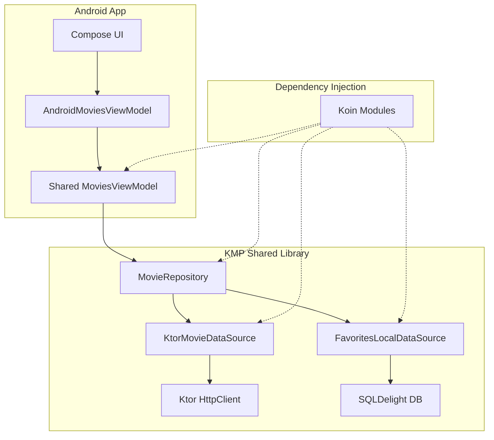

# CineVerse 🎬

A polished movie showcase app demonstrating Kotlin Multiplatform (KMP) library integration with a Jetpack Compose Android app, featuring smooth animations, shared element transitions, and clean architecture.

## Features

- **Movies Grid** - Browse movies in a responsive grid with poster, title, and favorite toggle
- **Live Search** - Filter movies with 300ms debounced search for smooth performance
- **Movie Details** - Full details with shared element transitions and staggered reveal animations
- **Favorites** - Real-time synced favorites across all screens with local persistence
- **Long-press Animations** - Card lift effect with info overlay on long press

## Video Demo

https://github.com/user-attachments/assets/219ac676-6f5b-448e-8747-be95ebecc8ee

## Architecture

The project follows **Clean Architecture** with **MVVM** pattern and **Unidirectional Data Flow (UDF)**:



### State Management

- **Single Source of Truth**: `MovieRepository` combines remote movies with local favorites
- **Reactive Updates**: `StateFlow` and `Flow.combine()` for instant UI updates
- **Unidirectional Flow**: State flows down, actions flow up

## Package Structure

```
CineVerse/
├── app/                          # Android Application
│   └── src/main/java/
│       ├── com/android/cineverse/
│       │   ├── di/               # Koin DI modules
│       │   ├── ui/
│       │   │   ├── components/   # Reusable Compose components
│       │   │   ├── screens/      # Screen composables
│       │   │   └── viewmodel/    # Android ViewModels
│       │   └── CineVerseApplication.kt
│       └── org/android/cineverse/
│           ├── ui/theme/         # Material3 theming
│           ├── MainActivity.kt   # Navigation host
│           └── SharedTransitionLocals.kt
│
└── shared/                       # KMP Library (published separately)
    └── src/
        ├── commonMain/
        │   └── org/android/cineverse/shared/
        │       ├── data/
        │       │   ├── local/    # SQLDelight data source
        │       │   ├── remote/   # Ktor data source
        │       │   └── repository/
        │       ├── domain/model/ # Domain models
        │       ├── presentation/ # Shared ViewModel
        │       └── di/           # Shared Koin module
        ├── androidMain/          # Android-specific (SQLDelight driver)
        └── iosMain/              # iOS-specific (SQLDelight driver)
```

## Libraries Used

### Android App
| Library | Purpose |
|---------|---------|
| Jetpack Compose | Modern declarative UI |
| Material3 | Design system & theming |
| Navigation Compose | Screen navigation |
| Koin | Dependency injection |
| Coil | Image loading |
| Paging 3 | Infinite scrolling (bonus) |

### KMP Shared Library
| Library | Purpose |
|---------|---------|
| Ktor Client | HTTP networking |
| kotlinx.serialization | JSON parsing |
| SQLDelight | Local database |
| Koin | Dependency injection |
| Kotlinx Coroutines | Async operations |

## API

This app uses a **Mock API** powered by Ktor MockEngine for demonstration purposes. The mock data is defined in `MockData.kt`.

To switch to a real API (e.g., TMDB):
1. Replace `MockEngine` with `OkHttp` (Android) or `Darwin` (iOS) engine
2. Update base URL in `SharedModule.kt`
3. Add your API key as a build config field

## Setup & Running

1. **Clone the repository**
   ```bash
   git clone https://github.com/yourusername/CineVerse.git
   ```

2. **Ensure KMP shared library is published**
   ```bash
   cd shared/
   ./gradlew publishToMavenLocal
   ```

3. **Open in Android Studio**
   - Open the `CineVerse` folder
   - Sync Gradle files

4. **Run the app**
   ```bash
   ./gradlew :app:installDebug
   ```

## Build Variants

| Variant | Package | Features |
|---------|---------|----------|
| Debug | `org.android.cineverse.debug` | Debug logging, side-by-side install |
| Release | `org.android.cineverse` | Minified, optimized |

## Demo

<!-- Add your demo GIF here -->


## License

MIT License - See [LICENSE](LICENSE) for details.
